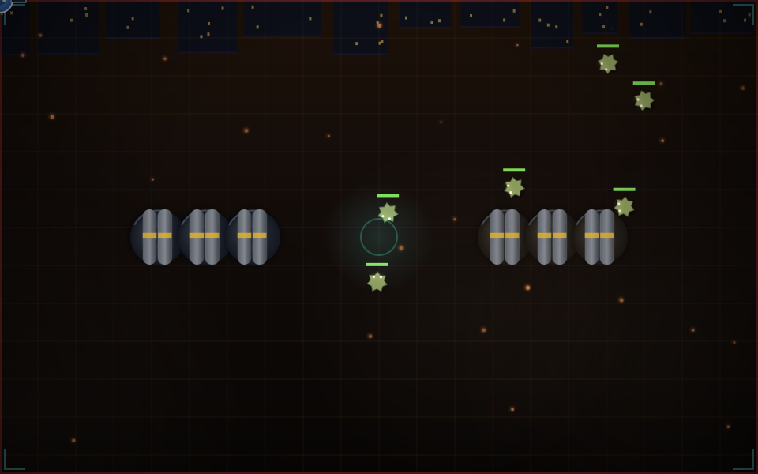
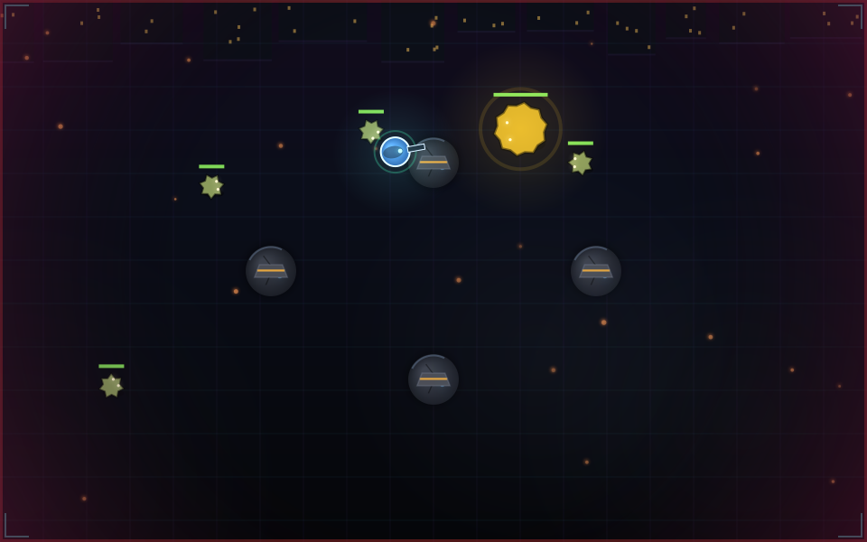
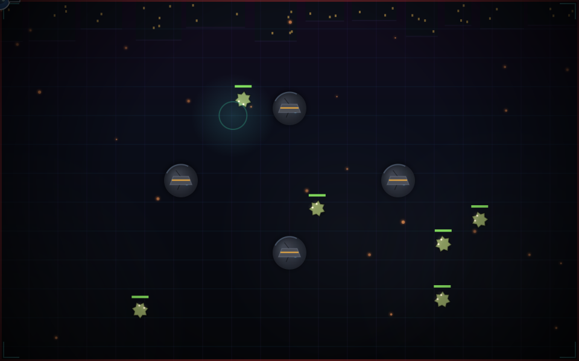

<p align="center"></p>

<div align="center">

```
███╗   ██╗██╗ ██████╗ ██╗  ██╗████████╗███████╗ █████╗ ██╗     ██╗          ███████╗███████╗██████╗  ██████╗
████╗  ██║██║██╔════╝ ██║  ██║╚══██╔══╝██╔════╝██╔══██╗██║     ██║          ╚══███╔╝██╔════╝██╔══██╗██╔═══██╗
██╔██╗ ██║██║██║  ███╗███████║   ██║   █████╗  ███████║██║     ██║            ███╔╝ █████╗  ██████╔╝██║   ██║
██║╚██╗██║██║██║   ██║██╔══██║   ██║   ██╔══╝  ██╔══██║██║     ██║           ███╔╝  ██╔══╝  ██╔══██╗██║   ██║
██║ ╚████║██║╚██████╔╝██║  ██║   ██║   ██║     ██║  ██║███████╗███████╗    ███████╗███████╗██║  ██║╚██████╔╝
╚═╝  ╚═══╝╚═╝ ╚═════╝ ╚═╝  ╚═╝   ╚═╝   ╚═╝     ╚═╝  ╚═╝╚══════╝╚══════╝    ╚══════╝╚══════╝╚═╝  ╚═╝ ╚═════╝
```

### SURVIVE. ADAPT. FIGHT BACK.

*A top-down browser survival-shooter. Waves never stop, the difficulty watches how you play, and the night always sends one more.*


<table>
<tr><td align="center">🎮</td><td align="center">🔫</td><td align="center">🗺️</td><td align="center">🧠</td><td align="center">🔧</td></tr>
<tr>
<td align="center"><a href="https://jeevan-0508.github.io/nightfall-zero/"><b>PLAY NOW</b></a></td>
<td align="center"><a href="#the-arsenal"><b>8 WEAPONS</b></a></td>
<td align="center"><a href="#the-maps"><b>3 MAPS</b></a></td>
<td align="center"><a href="#the-adaptive-director"><b>ADAPTIVE AI</b></a></td>
<td align="center"><a href="#the-armory"><b>THE ARMORY</b></a></td>
</tr>
<tr><td align="center">Browser, no install</td><td align="center">Pick your rack</td><td align="center">Circles, not corridors</td><td align="center">Watches how you play</td><td align="center">Scrap carries over</td></tr>
</table>

</div>

**[Open the live game](https://jeevan-0508.github.io/nightfall-zero/)**, no download, no sign-in, WASD and a mouse.

## 📸 Screenshots

<p align="center">


</p>
<p align="center">

</p>

These are real frames from the game's own render pipeline (`src/game/render/renderer.ts`), captured by driving an
actual `GameEngine` and its actual `draw()` function through `node-canvas` rather than a live browser tab, since
this project is normally built and shipped headless. They show the canvas arena exactly as it draws; the HTML
HUD overlay (health bar, weapon, minimap, wave counter) is a separate React layer on top and isn't in these
three. **[Play the live game](https://jeevan-0508.github.io/nightfall-zero/)** to see the whole thing together.

## 🎬 Gameplay Clip

<p align="center">
<a href="https://github.com/Jeevan-0508/nightfall-zero/releases/download/media-gameplay-clip/nightfall-zero-gameplay.mp4">

<br>▶ Click to play a real gameplay recording (.mp4)
</a>
</p>

GitHub READMEs can't autoplay a `<video>` tag, so this links out to the actual clip - a real recorded run, hosted
as a [release asset](https://github.com/Jeevan-0508/nightfall-zero/releases/tag/media-gameplay-clip) rather than
committed into the repo itself.

## ⚡ What Is This?

**NIGHTFALL // ZERO** is a wave-survival shooter built entirely in the browser: React for the shell, a hand-rolled
2D canvas engine underneath for everything that moves. Pick a starting weapon, drop into an arena, and hold out
against enemies that get smarter, faster, and more numerous every wave, until a boss walks in and the fight changes
shape entirely.

There is no backend, no save server, and no asset pipeline. Every weapon, enemy, boss attack, obstacle layout, and
upgrade is a plain TypeScript object. The whole game is one deterministic seeded simulation: give it the same seed
and the same inputs, and it replays byte-for-byte, which is also how every mechanic in it is unit-tested.

## 🎮 How to Play

| Input | Action |
|---|---|
| **WASD** / Arrow keys | Move |
| **Mouse** | Aim |
| **Click** | Fire |
| **1–8** | Switch weapon |
| **SHIFT** | Dash (brief invulnerability) |
| **Q** | Throw grenade |
| **E** | Overcharge (temporary fire-rate + speed boost) |
| **ESC** | Pause / resume |

A HUD button below the minimap (and a matching checkbox in Settings) toggles **auto-aim**: leave the mouse
still for a moment and it locks onto and fires at the nearest living enemy on its own, standing its ground until
you move the mouse again, which hands manual aim and fire straight back to you.

Pick a starting weapon on the loadout screen, then survive. Every wave adds more enemies; every five waves, a
boss. Level up mid-run to choose from randomized stat upgrades. Every run also earns scrap, spendable in the
Armory on permanent upgrades that carry into the next one. There is no win condition, the score is how long
you last.

## 🔫 The Arsenal

Eight weapons, all carried from the start, switchable mid-run with 1–8. The loadout screen picks which one is
already in your hand when the wave begins.

| # | Weapon | Role |
|---|---|---|
| 1 | **Pistol** | Reliable sidearm, high crit chance |
| 2 | **Shotgun** | Six-pellet spread, brutal up close, useless at range |
| 3 | **SMG** | High fire rate, low per-shot damage, chews through ammo |
| 4 | **Assault Rifle** | The default all-rounder |
| 5 | **Sniper** | One shot, five in the mag, meant to one-tap from range |
| 6 | **Flamethrower** | Enormous magazine, short range, sustained close-quarters damage |
| 7 | **Rocket Launcher** | Splash damage, four rockets, clears a crowd |
| 8 | **Energy Weapon** | Pierces through multiple enemies in a line |

## 👹 Enemies & Bosses

Four AI behaviors, each reading the same battlefield differently:

- **Melee**: closes distance and attacks on contact
- **Ranged**: holds distance, fires back
- **Stalker**: cloaks and uncloaks on a timer, closing in while invisible
- **Boss**: a three-attack state machine, a telegraphed ground **slam**, a locked-direction **charge** dash, and
  a **barrage** of spread projectiles. Every attack telegraphs before it lands, on a fixed rotation, so reading
  the tell is the actual skill check. Two bosses run on that same state machine with different stats, alternating
  every encounter: the tanky **Overlord** first, then the faster, harder-hitting **Executioner**, back to the
  Overlord on the third, and so on.

## 🗺️ The Maps

Three obstacle layouts, picked deterministically by the run's seed. Every obstacle is a circle, matching the
game's collision system exactly: no rectangles, no pathfinding grid, just solid terrain that blocks players,
enemies, the boss, and every projectile in flight.

| Map | Character |
|---|---|
| **Crossroads** | Four pillars in a diamond around the center; open lanes, easy sightlines |
| **Bunker** | Two solid wall segments with a single chokepoint gap; funnels every fight |
| **Scatter** | Six irregular rubble piles, no clean lane through any of them |

## 🧠 The Adaptive Director

A lightweight difficulty director watches damage taken, kills per second, and remaining health ratio, and nudges
spawn pacing and enemy mix in response, the same idea as Left 4 Dead's AI Director scaled down to one metric feed.
It cannot spawn a boss early or skip a wave; it only leans the existing wave definitions toward more or less
pressure.

A second, independent read on play style (camper, kiter, brawler, edge-hugger, or a weapon-loadout equivalent)
reorders the spawn queue toward whichever enemy type counters it, e.g. pulling Runners forward against a kiter
or Exploders forward against a camper. The first time a read actually changes, a "DIRECTOR // ANALYSIS" readout
surfaces on-screen so the adaptation is visible instead of a hidden mechanic, on a cooldown so it can't spam.

## ⚡ Run Events

From wave 3 onward, every wave start has a chance to roll one of three timed events, never two at once, with a
cooldown between them:

| Event | Effect |
|---|---|
| **Blackout** | Vision collapses toward a near-total-black vignette and the minimap hides every non-boss blip |
| **Hunted** | Spawn pacing spikes and the mix skews toward tougher enemies until it ends |
| **Supply Drop** | A pickup appears on the map; walk over it for a heal and a burst of XP |

A HUD banner calls out every event, and Overcharge, the moment it starts.

## 🗂 Menus

Main menu branches three ways: **PLAY** into loadout and mode select, **ARMORY** to spend scrap, and
**SETTINGS** for a single master-volume slider (plus the auto-aim toggle above), saved to `localStorage` and
applied immediately, live. **ESC** during a run opens a pause menu (resume, restart, or quit to the main menu)
without disturbing anything the level-up overlay is already showing.

Leave mid-run, paused or straight to the menu, and a **CONTINUE - WAVE n** button appears above PLAY next time,
skipping the loadout screen and picking back up with the same health, level, upgrades, weapon, and wave. The
run autosaves every few seconds and the instant you pause; dying clears the save.

## 🎯 Game Modes

Picked on the loadout screen alongside the starting weapon, each mode is a small set of rule modifiers the
engine applies once at construction; no separate content, just different pressure.

| Mode | Effect |
|---|---|
| **Standard** | The default fight. No modifiers, boss every 5 waves. |
| **Blitz** | Enemies spawn 30% faster, boss every 3 waves. Short, frantic runs. |
| **Onslaught** | Enemies hit 40% harder and carry 30% more health. Scrap payouts run 50% higher. |

## 🎲 Seeds & Replay Codes

Every run is one deterministic simulation driven by a single numeric seed. Leave the loadout screen's seed field
blank and it draws a fresh random one; type anything into it (a word, a friend's name, a number) and that text is
hashed into a seed with FNV-1a, so the same text always produces the same run. When you die, the game-over screen
shows the run's exact seed with a one-click copy button, paste it back into the loadout screen and the wave
spawns, enemy positions, and boss timing all replay identically, matching the same inputs.

## 🔧 The Armory

Every run pays out scrap: two per kill, one per second survived, ten per wave reached, boosted by the
Scavenger's Network rank. Spend it in the Armory, reachable from the main menu, on five permanent upgrades that
apply directly to the player created for your next run, before wave one even starts. Nothing here is a
consumable; every rank is owned forever once bought.

| Upgrade | Effect | Max Rank |
|---|---|---|
| **Vitality Implant** | +10 max health per rank | 5 |
| **Plating Mod** | +10 max armor per rank | 5 |
| **Combat Drills** | +5% weapon damage per rank | 5 |
| **Field Conditioning** | +5% move speed per rank | 3 |
| **Scavenger's Network** | +10% scrap earned per rank | 3 |

Balance, ranks, and lifetime stats (total runs, total kills, best survival time, best wave) persist in
`localStorage`, so they survive a page reload. Nothing else in the game does.

## 🛠 Technologies Used

| Layer | Technology | Purpose |
|---|---|---|
| UI shell | **React 19** | Menus, loadout screen, HUD, overlays |
| Language | **TypeScript 6** (strict) | Every entity, weapon, and AI state machine is a typed object |
| Rendering | **Canvas 2D** (hand-rolled) | The actual game: player, enemies, projectiles, particles, obstacles |
| State | **Zustand 5** | Menu/loadout/armory/game-over view routing, HUD snapshot store, `persist`-backed meta-progression |
| Build | **Vite 8** | Dev server and production bundling |
| Testing | **Vitest 5** (happy-dom) | 330 tests over pure engine/AI/collision logic, zero UI-snapshot tests |
| Lint | **oxlint** | Fast, zero-config linting |
| Runtime | **bun** | Install, dev, test, build |
| Hosting | **GitHub Pages** | Static deploy via GitHub Actions on every push to `main` |

## 🏗 Architecture

```
src/game/engine/     GameEngine orchestrator, deterministic seeded rng, shared types, vector math, particles
src/game/entities/    Factories for player/enemy/projectile; every id counter lives here
src/game/combat/      Damage resolution, weapon firing/reload, explosions, ranged attacks, abilities, auto-aim
src/game/ai/          Enemy behavior state machines, boss attack rotation
src/game/collision/   Circle-circle and circle-obstacle intersection + push-out resolution
src/game/waves/       Spawn queueing, obstacle-aware spawn placement, wave completion
src/game/director/    Adaptive difficulty director
src/game/events/      Run-event state machine (Blackout, Hunted, Supply Drop)
src/game/render/      Canvas 2D draw pipeline
src/game/meta/        Pure meta-progression logic: scrap payout, upgrade cost curve, applying owned ranks
src/content/          Data only: weapons, enemies, waves, upgrades, abilities, maps, meta-upgrades
src/store/            Zustand stores: game view/loadout/armory, HUD snapshot, persisted meta-progression
src/ui/               React components: canvas host, HUD, menus, overlays
src/tests/            330 tests, one file per subsystem, testing pure functions directly
```

The engine is a plain class with no framework dependency: `GameEngine.update(dt, input)` advances one frame and
`GameEngine.getHudSnapshot()` returns a primitives-only snapshot for the UI to render. Every AI/combat/collision
function takes the state it needs directly rather than the whole engine, which is what makes each one testable in
isolation without spinning up a canvas or a browser.

## 🚀 Run It Locally

```bash
git clone https://github.com/Jeevan-0508/nightfall-zero.git
cd nightfall-zero
bun install
bun run dev         # http://localhost:5173/nightfall-zero/
bun run test        # 330 tests
bun run typecheck
bun run build
```

Requires [bun](https://bun.sh).

## 📖 Honest Limitations

- **Two bosses.** The attack-rotation state machine (telegraph, attack, cooldown) is built to hold any number of
  boss definitions; only the Overlord and the Executioner ship today, alternating every encounter.
- **No weapon pickups.** Every weapon and ability is available from the first frame. The loadout screen picks
  what you start equipped with, not what you have access to. The one exception is the Supply Drop run event,
  which does spawn a real pickup entity on the map.
- **One save slot for progress, one checkpoint for a run.** The Armory's scrap, upgrade ranks, and lifetime
  stats persist in `localStorage` as the single permanent save, no cloud sync, no export/reset from the UI. A
  separate, secondary save lets you resume the current run after closing the tab, but it is a checkpoint, not a
  frame-perfect freeze: resuming restarts the current wave fresh rather than mid-fight, so the exact enemies on
  screen and any in-progress run event do not carry over.
- **No sound files.** Every effect is a synthesized Web Audio oscillator, not a mixed sample, so combat audio is
  functional rather than produced.

## Licence

MIT. Built by [Jeevan Siddhabhaktula](https://github.com/Jeevan-0508).
